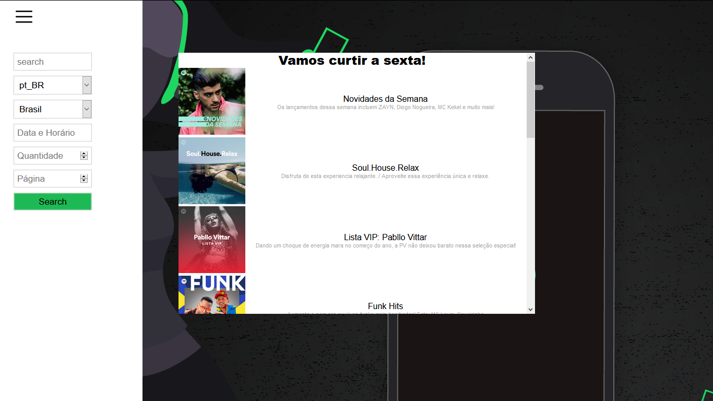

# SPOTIFY WEB

<p align="center">
  <a href="https://github.com/thedarkzeno">
        
    </a>
  
</p>


> Search by playlists with a simple interface

<p align="center"></p>
<p align="center"></p>

## Summary 

- [Overview ](#eyes-overview)

- [Pre requisites](#warning-pre-requisites)

- [How to run](#construction_worker-how-to-run)

- [Dependencies](#books-dependecies)

- [License](#license)

## :eyes: Overview 

<p align="justify">
  With Spotify-web you can search in a catalog with millions of playlists from spotify API.
</p>


## :warning: Pre requisites

- [Node](https://nodejs.org/en/download/)


## :construction_worker: How to run:

First, you need a valid client id of the [spotify](https://www.spotify.com/), you can create one [here](https://developer.spotify.com/dashboard/applications).

Clone the project from github:

```shell
git clone https://github.com/thedarkzeno/spotify-web
cd spotify-web
```

Copy the `.env.example` file into `.env`

```shell
cp .env.example .env
```

Put the CLIENT ID created on specific field (`REACT_APP_CLIENT_ID`)

Install dependencies:

```shell
yarn
# or
npm i
```

Start the application:

```shell
yarn start
# or
npm start
```

## :books: Dependencies 

- [React](https://pt-br.reactjs.org/docs/create-a-new-react-app.html)
- [React Router DOM](https://reacttraining.com/react-router/web/guides/quick-start)
- [Redux](https://redux.js.org/)
- [Styled Components](https://styled-components.com/)
- [Axios](https://github.com/axios/axios)


## License

The [MIT License]() (MIT)


---

<p align="center">
Made with :heart: by <a href="https://www.linkedin.com/in/adalberto-junior-62618a176/">Adalberto</a>
</p>

